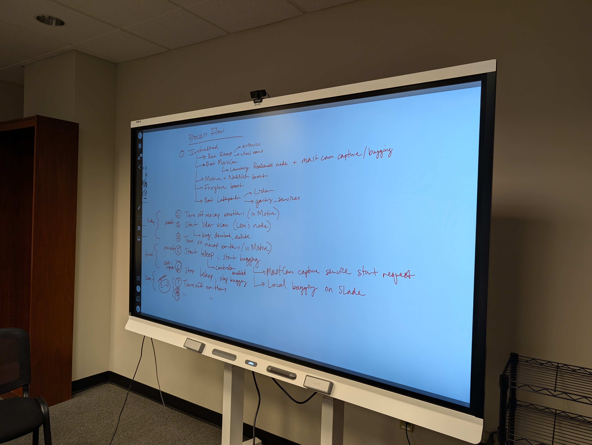

# Perception Campaign Fall 2025

# START UP & INITIALIZATION

These startup routines result in all data streams, payloads, controls, and avionics to be initialized and published.

## ROSEY - state interfaces, control interfaces, state topics

### Swap teensy and SD card for perception
1.	Unplug teensy from breadboard in Rosey
2.	Replace with OUR teensy flashed with ros2 control stack
3.	Replace SD card in avionics Pi

### Start up rover hardware
1. Open terminal on Slade
2. Run: 

	```bash
 	ssh rosey@192.168.2.50 -i ./ssh/id_rsa_ansible
 	OR
    ssh rosey@192.168.2.50 -> PW: roseyrover
    ```

		# If issues happen with ssh:
		ssh-keygen -R 192.168.2.50 (this needs to be done every time sd card swap)

    ```bash
	source CubeRover/install/setup.bash
	ros2 launch roseybot_control hardware_startup.launch.py 
    ```

### Enable controller-based teleop of Rosey
3. Open terminal on NUC
4. Run: 
    ```bash
        source CubeRover/install/setup.bash
        ros2 launch roseybot_control joystick.launch.py # Ryan check syntax
    ```

## MAST CAM - RGBD Forward

1. Open terminal on Slade
2. Run: 

    ```bash
        ssh dev@192.168.2.104 -> PW: regolith 		
        cd roselab-perception
        ./scripts/launch_realsense_d456.sh
    ```
3. Open another tab on the slade and run:
    ```bash
        ssh dev@192.168.2.104 -> PW: regolith 		
        cd roselab-perception
        source venv/bin/activate
        source ros/install/setup.bash
        ros2 run mastcam_service mastcam_capture_service  
    ```


## WHEEL CAM - x4 RGB Cameras

1. Open WSL terminal on Slade
2. Run: 
    ```bash
        ssh picam@192.168.2.51 -> PW: roseycam
        ./boot.sh
    ```
3. Open terminal on the slade
4. In the home directory run:
	```bash
		./perception_boot.sh
	```

## LIDAR & GANTRY SYSTEM

1. NoMachine -> Gantry Computer PW: M3Robotics 
2. Open NoMachine application and select the Gantry Computer 
3. Once window opens showing the desktop, open three terminal tabs:
or
1. ssh gantry@192.168.2.99 -i .ssh/id_rsa_ansible

- In first tab:

    ```bash
        cd ~/gantry_control
        ./run_roselab_perception.sh
    ```
- In second tab:
    ```bash
        cd ~/roselab-perception
        source /opt/ros/jazzy/setup.bash
        source ros/install/setup.bash
        ros2 run gantry_services gantry_capture_service
    ```

4. ssh into the lattepanda from the Nuk -> ssh gantry_lattepanda@192.168.2.4 -> PW: M3Robotics
- Open tab:
    ```bash
        cd /m3_robotics/gantry_control
        ./runSystem --no-gui
    ```

## OPTITRACK - Pose
1. Open motive on slade and select CubeRover from assets tab
2. Open terminal on NUC
3. Run: ./optitrack.sh
4. Make sure it reads Activated! If not, restart

## FOXGLOVE - HUD

1. Open WSL terminal on Slade
2. Run: ./foxglove_boot.sh
3. Open foxglove desktop app on NUC, select Slade address ws://... url to open perception layout

## GROUND CONTROL - Session data collection and bagging
1. Open terminal on slade:
    ```bash
        cd roselab-perception/ros
        source install/setup.bash
        ros2 launch perception_ground_control launch_ground.py duration:='{lidar scan duration}'
    ```
2. Open new tab on slade:
    ```bash
        cd roselab-perception/ros
        source install/setup.bash
        ./src/perception_ground_control/scripts/ground_control.sh

3. Check all needed topics are being published with ros2 topic list
4. Record testbed on reolink
5. TURN OFF MOTIVE CAMERAS FOR THE LOVE OF GOD
6. press enter on ground_control.sh to start lidar scan
7. TURN MOTIVE CAMERAS BACK ON FOR THE LOVE OF GOD
8. Start and stop mastcam and rosey data collection

------------------------------------------------------------------------

# COLLECTION SCRIPTS
1. In (Slade) ~/roselab_perception/scripts you can run
   capture_lidar_once.sh
   or
   capture_rosey_mastcam_once.sh

# DATA INVENTORY
The ground control must bag the following topics during each *trial*. Note that the wild card (asterisk) operator is all topics underneath that topic namespace:

### ROSEY
/CubeRover_V1/pose

/bno055/*

/cmd_vel

/dynamic_joint_states

/initialpose

/joint_states

/joy

/joy/*

/robot_description

/roseybot_base_controller/*

/rosout

/tf

/tf_static

And any others that y'all deem important to working with the data during playback.

### WheelCams
RH: TODO - these are same topics from mobility, Cameron should know their names

### MastCam
MastCam Pi should bag the following topics during each *trial*:

RH: TODO - list all topics we need here but basically already set up in the launch script within roselab-perception/scripts

Color, Aligned-depth-to-color, tfs, camera info topics, extrinsics, etc

------------------------------------------------------------------------
# DEBUGGING
If ROS2 topic list is not working or services that should be available are not showing, do 
```bash
	ros2 daemon stop
	ros2 daemon start
```

------------------------------------------------------------------------


# PROCESS FLOW





